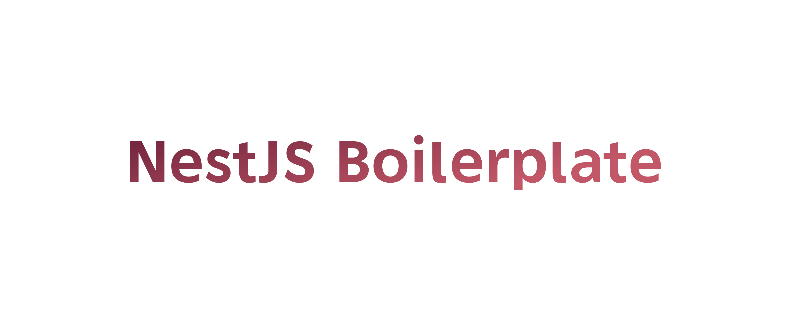

# NestJS Boilerplate

A production 🏭 ready NestJS boilerplate with batteries 🔋 included. No Kidding!



## Table of Content

- [NestJS Boilerplate](#nestjs-boilerplate)
  - [Table of Content](#table-of-content)
  - [Introduction](#introduction)
  - [Getting Started](#getting-started)
  - [NPM Commands](#npm-commands)
  - [Batteries](#batteries)
    - [Configuration](#configuration)
    - [Request Helpers](#request-helpers)
    - [Response Helpers](#response-helpers)
    - [Exception Handling](#exception-handling)
    - [Helpers](#helpers)
    - [Transformers](#transformers)
    - [Controllers](#controllers)
    - [Validators](#validators)
    - [Repositories](#repositories)
  - [Contributing](#contributing)
  - [About Us](#about-us)
  - [License](#license)

## Introduction

We started working with NestJS few months back, we were blown away with the functionalities that it provides 🙇🙌. But for our use case we needed something more than just basic functionalities, that is when our team started working 🧑‍💻 on a boilerplate, which can be used for any project.

This boilerplate helps avoid the redundancy cycle each developer has to go through, it handles most of the repetitive 🔁 and tedious ⏲️ tasks, that (imma be honest 🤷) nobody likes.

## Getting Started

If you using Github GUI 🖥️ to initiate your project, consider following [this github doc.](https://docs.github.com/en/github/creating-cloning-and-archiving-repositories/creating-a-repository-from-a-template)

Git CLI 🔮 users, focus here:

```python
# head to your workspace
1. cd to/your/favourite/directory/on/the/system

# clone the template
2. git clone https://github.com/squareboat/nestjs-boilerplate your-project

# go to the directory where the clone happened
3. cd your-project

# let's set some environment variables
4. cp .env.example .env
5. vi/nano .env

# now, let's install the dependencies
6. npm install

# start the server in watch mode
7. npm run start:dev

# Boom 💥 and it is done!
```

**Optional Step:** When you cloned the repo, the git commit history also got cloned, to clean/erase the history 📜 and init your own repo, follow the following steps:

```python
# remove the .git directory from the project folder
1. rm -rf .git

# initialize a new repo on the same content
2. git init

# add the content to stage
3. git add .

# do your first commit
4. git commit -m  '🚀 INITIAL COMMIT'

# add origin url
5. git remote add origin git@github.com:<YOUR ACCOUNT>/<YOUR REPOS>.git

# do your firt push
6. git push -u origin master
```

## NPM Commands

This boilerplate contains following npm commands (apart from NestJS' one) to support you from the day one of your sprint. Yeah! We love to help 🙋🙏

```python
# Create a new db migration
npm run migration:create

# Runs all the pending migrations 😎
npm run migration:up

# Helps revert the db changes when you need to 😉
npm run migration:down
```

## Batteries

We have added some small and big batteries 🔋 to achieve the stage where a developer don't have to worry about such things ❤️.

### Configuration

🚧 Soon to be updated! 🚧

### Request Helpers

1. `all()`: Method to get the incoming parameters, all at once. No need to get `body`, `queryParams`, and `params` seperately every time.

```javascript
const inputs = req.all();
```

### Response Helpers

We have our own very generous set of api guidelines, we used our learning of multiple projects to provide structural consistency of response object (which is often unknowningly abused).

- `success(data: Record<string, any>, status=200)`: Returns the success response, use this whenever your request is succesfull, usually for GET and POST requests.

```javascript
/**
 * {
 *  success: true,
 *  code: 200,
 *  data: { message: "Hello There" }
 * };
 **/
return res.success({ message: 'Hello there!' });
```

- `error(error: Record<string, any> | string, status = 401)`: Returns the error response, used in exception filter.

```javascript
/**
 * {
 *  success: false,
 *  code: 401,
 *  message: 'Unauthorized'
 * };
 **/
return res.error('Unauthorized!');
```

- `noContent()`: There are cases when we need to send only a success status code and no body. `noContent()` will come in handy for you.

```javascript
// will return a response with status code of 204
return res.noContent();
```

- `withMeta(data: Record<string, any>, status = 200)`: There can be some case where we need to send some payload to support our requested data. For example, pagination information incase of a paginated response. `withMeta` helps you achieve the same.

```javascript
/**
 * {
 *  success: true,
 *  code: 200,
 *  data:[{},{},{}]
 *  meta: {
 *    pagination: {
 *      totalPages: 10,
 *      currentPage: 2,
 *    },
 *    ...some other custom attributes
 *  }
 * };
 **/
return res.withMeta({
  data: [{}, {}],
  pagination: { totalPages: 10, currentPage: 2 },
});
```

### Exception Handling

NestJS provides option of writing your own exception filters. We have added an exception filter with all the necessary exceptions to help you get started on the project very quickly.

> No configuration is needed on your side. It is already added as a Global filter. 💥

### Helpers

Think of this as a randomly used stateless functions which can be used anywhere and anytime. We have included a bunch of "helper" functions. Many of them are used inside the template, you are free to use it at your convenience.

- `uuid(): string`: Generate and returns a v4 uuid string.

- `randomNumber(n: number): string` - Takes `n` param as length and returns a random numeric string.

- `httpBuildQuery(url: string, params = {})` - Takes `url` and `params` object, and returns a url with query string attached.

```javascript
/**
 * https://example.com?q=some%20search%20term
 */
httpBuildQuery('https://example.com', { q: 'some search term' });
```

- `basePath()`: Get the root/base path of the project, irrespective of the directory that you are in.

> You may want to add your helper function, you can do so by adding it to `/src/core/helpers/index.ts` file

### Transformers

Transformer provides a presentation and transformation layer for complex data output, for example JSON response in REST APIs. Let's see any example on how it works.

> Supports only JSON response for now.

We have already added a base `Transformer` class inside the `core` module, the driver of our logic.

- Let's create a `BookTransformer` for a model, say `Book`.

```javascript
// src/transformers/book.ts
import { Transformer } from '@app/core';

export class BookTransformer extends Transformer {
  async transform(book: Record<string, any>): Promise<Record<string, any>> {
    return {
      id: book.uuid,
      name: book.name,
      publisherName: book.publisher,
      publishedOn: moment(book.publishedAt).format('YYYY-MM-DD'),
    };
  }
}
```

Now to use the transformer, follow the steps below:

```javascript
//TheFileWhereYouWantToUseIt.ts
import { BookTransformer } from '@app/transformers/book';

const transformer = new BookTransformer();
const payload = await transformer.work({
  uuid: '75442486-0878-440c-9db1-a7006c25a39f',
  name: "NestJS Boilerplate",
  publisher: 'Squareboat'
  publishedAt: "2020-12-03 22:00:00",
});

/**
 * {
 *  id: "75442486-0878-440c-9db1-a7006c25a39f",
 *  name: "NestJS BoilerPlate",
 *  publisherName: "Squareboat",
 *  publishedAt: '2020-12-03'
 * }
 */
console.log(payload)
```

_Wait_, transformer provide much more than a wrapper class.
While creating REST APIs you may come across a case where you want to fetch some related data with the main data.

For example, you may want to fetch author details along with the details of the book's detail that you requested.

Transformer provides an option to add all the available includes and default includes a transformer.

```javascript
// src/transformers/book.ts
import { Transformer } from '@app/core';

export class BookTransformer extends Transformer {
  availableIncludes = ['author'];
  defaultIncludes = [];

  async transform(book: Record<string, any>): Promise<Record<string, any>> {
    return {
      id: book.uuid,
      name: book.name,
      publisherName: book.publisher,
      publishedOn: moment(book.publishedAt).format('YYYY-MM-DD'),
    };
  }

  async includeAuthor(book: Record<string, any>): Promise<Record<string, any>> {
    // fetch author of the book
    const author = book.author;
    return this.item(book.author, new AuthorTransformer());
  }
}
```

> Notice the "author" inside the `availableIncludes` and `includeAuthor` method, transformer will add include namespace to the requested include.

> AuthorTransformer is just like BookTransformer, but responsible for transformer author model.

Now to use the include the `author` option, we need to pass the `include` queryParam in the URL, like:
`/books/75442486-0878-440c-9db1-a7006c25a39f?include=author`

> For multiple includes, send comma seperated include options like include=author,publisher,releaseDetails

Now, inside your controller, do the following:

```javascript
//BookController.ts
import { Get} from '@nestjs/common';
import { BookTransformer } from '@app/transformers/book';


// inside the Books Controller
@Get('/books/:uuid')
async get(@Req() req: Request, @Res() res: Response): Promise<Response> {
  const inputs = req.all();
  const transformer = new BookTransformer();
  const payload = await transformer
  .parseIncludes(inputs.include)
  .work({
    uuid: '75442486-0878-440c-9db1-a7006c25a39f',
    name: "NestJS Boilerplate",
    publisher: 'Squareboat'
    publishedAt: "2020-12-03 22:00:00",
  });

  /**
   * {
   *  id: "75442486-0878-440c-9db1-a7006c25a39f",
   *  name: "NestJS BoilerPlate",
   *  publisherName: "Squareboat",
   *  publishedAt: '2020-12-03',
   *  "author": {"id": "a1", "name": "Vinayak Sarawagi"}
   * }
   */
  return res.success(payload);
}
```

In the `Controllers` topic, we will discuss how we have managed to automate these steps also.

### Controllers

Developers coming from MVC will know what is a controller and how it helps us to handle the request and response lifecycle.

For elegant handling we have added a base `ApiController` which has all the necessary functions to handle the response transformation.

- `transform(obj, transformer, options?)`: You might have noticed in the previous snippets, on how we created an instance of the transformer and ran the methods to process an output. To handle it more beautifully, you can handle it like below:

```javascript
//BookController.ts
import { Get} from '@nestjs/common';
import { BookTransformer } from '@app/transformers/book';


// inside the Books Controller
@Get('/books/:uuid')
async get(@Req() req: Request, @Res() res: Response): Promise<Response> {
  const inputs = req.all();
  const book = {
    uuid: '75442486-0878-440c-9db1-a7006c25a39f',
    name: "NestJS Boilerplate",
    publisher: 'Squareboat'
    publishedAt: "2020-12-03 22:00:00",
  };

  /**
   * Coding Pattern changed, output remains the same a above
   */
  return res.success(await this.transform(
    book, new BookTransformer, {req}
  ))
}
```

Notice, the `{req}` object that we are passing as third param, the base `ApiController` itself handles reading the url and parsing the includes. Now we don't need to do the tedious task again and again. 😃

- `collection(obj, transformer, options?)`: Same responsibility as the `transform` method. Use this whenever you need to transform an `array`.
- `paginate(obj, transformer, options?)`: Breaks down the `obj` passed into transformed data and pagination data. Expects the `obj` to include `pagination` key.
  > If you are dealing with some other key than `pagination`, you can change the key name inside `paginate` method in src/core/controllers/ApiController.ts file.

### Validators

🚧 Soon to be updated! 🚧

### Repositories

🚧 Soon to be updated! 🚧

## Contributing

🚧 Soon to be updated! 🚧

## About Us

We are a bunch of dreamers, designers, and futurists. We are high on collaboration, low on ego, and take our happy hours seriously. We'd love to hear more about your product. Let's talk and turn your great ideas into something even greater! We have something in store for everyone. [☎️ 📧 Connect with us!](https://squareboat.com/contact)

## License

The MIT License. Please see License File for more information. Copyright © 2020 SquareBoat.

Made with ❤️ by [Squareboat](https://squareboat.com)
